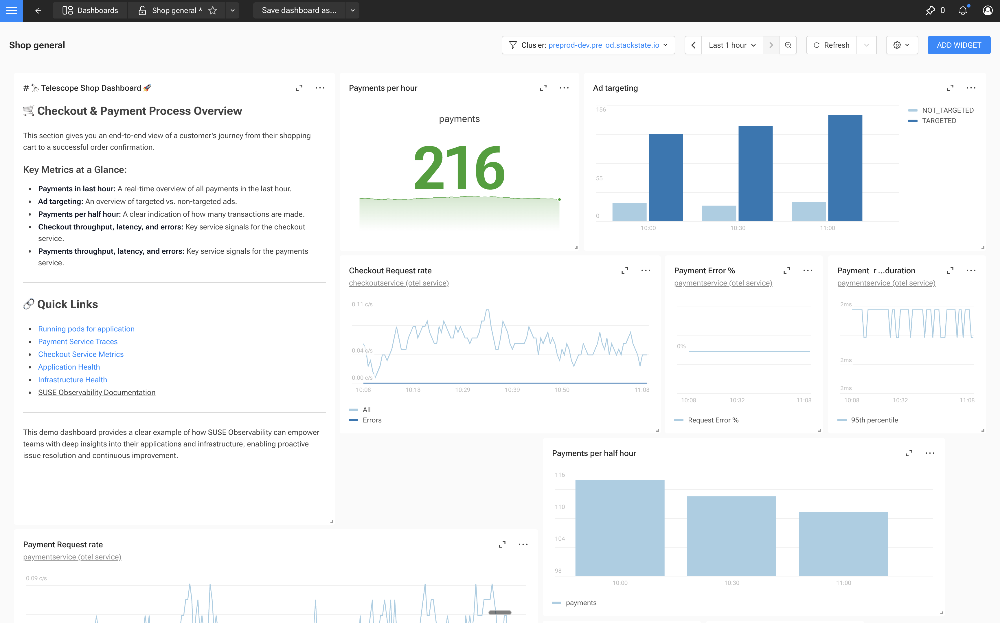

# Stop Context Switching: Native Dashboards That Know Your Kubernetes Architecture

*Introducing Enterprise Dashboarding for SUSE Observability*

---

## The 2 AM Context Switch

It's 2 AM. Your phone buzzes with an alert: latency spike on the checkout service. You're already awake—muscle memory kicks in.

Tab one: Grafana. You find the dashboard, but the spike is there, staring back at you. No context. Just a line going up.

Tab two: kubectl. You're hunting for the pod. Which namespace was it again? You scroll through output, squinting at timestamps that don't quite match the ones in Grafana.

Tab three: Your log aggregator. You paste in the pod name, adjust the time range—wait, is this UTC or local time? You're not sure anymore.

Tab four: Back to Grafana. You try to line up the timestamps manually. Was that memory spike at 2:03 or 2:04? Does it correlate with the latency spike, or are you chasing ghosts?

This is the "Alt-Tab tax" on troubleshooting. It's not just the context switching—it's that *you* become the integration layer. Each tool has its own time range, its own data format, its own view of the world. None of them talk to each other. You're the one correlating timestamps in your head, hoping you don't miss the connection that matters.

The hardest part of debugging isn't finding the data. It's connecting it.

---

## The Problem: Dashboards Are Dumb Glass

Here's an uncomfortable truth: most dashboards are just pixels. They show you *that* something happened, but not *why*. They display metrics in isolation, disconnected from the architecture that produced them.

**The cross-component visibility gap.** Your business processes span multiple services—a checkout flow touches the frontend, cart, payment gateway, inventory. But dashboards are static. You have to predict what you'll need to see together *before* the incident happens. When something breaks in a combination you didn't anticipate, you're back to building context on the fly.

**The troubleshooting friction.** You see a memory spike on one chart. Is it related to the latency spike on another? The charts don't know—they show their data, but not how it connects to the rest of your system. To find out, you need to manually correlate timestamps, open the component in another tool, check the logs, and hope you don't lose your place. The dashboard was supposed to be the answer. Instead, it's become another question.

**The missing piece.** Whether you're running a separate dashboarding tool or doing without, there's a gap. Custom dashboards that understand your architecture and integrate with your troubleshooting workflow—that's what's been missing. You shouldn't need to maintain another tool just to visualize your metrics, and you shouldn't have to go without dashboards because the alternatives don't fit your workflow.

The industry promised us a "single pane of glass." What we got was a dozen panes, none of them talking to each other.


---

## The Solution: Dashboards That Know Your Architecture

What if your dashboard understood your system the way you do?

SUSE Observability's Enterprise Dashboarding isn't just another charting tool. It's native to the platform—no datasource configuration, no plugin management, no separate login. It understands your topology out of the box, because it's built on the same foundation that powers your component views, health monitoring, and troubleshooting workflows.

**Stop managing dashboards. Start using them.**


*Each widget links directly to the component in your architecture. Click the chart, see the context.*

The difference is in the details. Every widget knows where its data comes from. That time series showing memory usage? Click on the link, and you're looking at the pod in your topology—not a query builder, not a search box, but the actual component with its health state, related services, and full context.

This is what we mean by "topology-aware." Your dashboards aren't isolated charts floating in space. They're connected to your architecture, giving you a sense of direction when you need it most.

**What you get:**
- Five core widget types: Time Series, Bar Chart, Stat, Gauge, and Markdown
- Full PromQL support with auto-complete for labels and values
- Variables for dynamic filtering across clusters, namespaces, and services
- Automatic links from widgets to their source components

Here's a concrete example. Say you want to track the top 5 pods by CPU usage across your cluster:

```promql
topk(5, sum by (pod_name) (rate(container_cpu_usage_seconds_total{namespace="${namespace}"}[5m])))
```

Drop that into a Time Series widget, add a `${namespace}` variable, and you've got a dashboard that works across every namespace in your cluster—with each data point linking back to the actual pod in your topology.

---

## The Workflow: Build Context, Don't Just View It

Here's where things get interesting. Most dashboards are destinations—you go there to look at data. SUSE Observability dashboards are workflows—you build them as you investigate.

**The Pin-to-Dashboard workflow:**

You're investigating a latency spike on the catalog service. While looking at the component, you notice memory usage correlating with the spike. One click to pin the metric. Another click to add it to a dashboard—new or existing. You keep investigating, pinning more metrics as you go. By the time you've found the root cause, you've built a "War Room" view that captures the entire investigation.


*Pin it. Build it. Fix it.*

This isn't just convenient—it changes how you troubleshoot. Instead of predicting what you'll need to see before an incident, you build context in real-time as you investigate. The dashboard becomes a record of your investigation, not a static display you hope has the right charts.

**Time Travel: Context preservation**

And because this is SUSE Observability, your dashboard inherits Time Travel. You're not just setting a time range on a chart—you're freezing the state of the entire system. View your dashboard at any historical point. Share the exact moment with colleagues: "Look at 2:47 AM when the spike happened." Everyone sees the same context, the same state, the same relationships.

The dashboard is a workflow, not a destination.

---

## Why Native Matters

Let's address the elephant in the room: Grafana.

Grafana is excellent at visualization. If you need 50 widget types, custom plugins, or highly specialized visualizations, it's still the right tool. But for most troubleshooting and cross-component visibility use cases? Native wins.

| Aspect | Typical Approach (Grafana) | SUSE Observability |
|--------|---------------------------|-------------------|
| Setup | Configure datasources, manage plugins | Native—just works |
| Context | Charts are isolated | Widgets link to topology |
| Troubleshooting | Separate workflow | Integrated pin → dashboard |
| Time Travel | Manual time range selection | System-wide state preservation |
| Maintenance | Another tool to manage | Part of the platform |

**The real cost of "build it yourself":**

The typical DIY observability stack looks something like this: Prometheus for metrics, Elasticsearch or Loki for logs, Jaeger for traces, and Grafana to try and tie it all together. Each tool has its own data model, its own query language, its own way of thinking about time. Grafana can visualize all of them—but it can't correlate them. You're still the one jumping between datasources, mentally mapping a trace ID to a log entry to a metric spike.

SUSE Observability is different. Metrics, logs, traces, and topology live in one platform, correlated by default. When you build a dashboard, you're not stitching together disconnected datasources—you're visualizing data that already understands how your components relate to each other.

**What we're not:**

We're not trying to be a dashboarding tool. We're an observability platform with dashboarding capabilities that integrate deeply with topology, health, and troubleshooting features. We have five widget types, not fifty. We focus on the use cases that matter most: cross-component visibility and faster troubleshooting.

If you need a dedicated visualization platform with endless customization, Grafana is still there. But if you want dashboards that understand your architecture and integrate with your troubleshooting workflow? That's what we built.

---

## Putting It Together: Real-World Use Cases

Let's make this concrete with two dashboards you can build today.

### Use Case 1: The Technical Dashboard

You're responsible for the payment service. You need to know when it's struggling before customers start complaining.

**Your dashboard:**
- **Time Series:** Response times over the last hour
- **Stat:** Current request rate (big number, easy to spot)
- **Time Series with topk:** Top 5 pods by CPU usage
  ```promql
  topk(5, sum by (pod_name) (rate(container_cpu_usage_seconds_total{namespace="payments"}[5m])))
  ```
- **Gauge:** Memory saturation against limits

Every widget links back to its source component. See a spike on the CPU chart? Click through to the pod, check its logs, trace a request—all without leaving the platform.

### Use Case 2: The Business Dashboard

Your VP wants to know if checkouts are healthy. They don't care about pods or namespaces—they care about revenue.

**Your dashboard:**
- **Stat:** "1,247 successful checkouts in the last hour"
- **Time Series:** Checkout success rate over time
- **Markdown:** Links to technical dashboards for each service in the checkout flow


*Business KPIs with one-click drill-down to technical details.*

When the success rate dips, your VP clicks the markdown link to the payment service dashboard. They see the technical view. They understand the impact. No Slack thread required.

This is the power of native dashboards: business context and technical depth in the same platform, connected by your architecture.

---

## Get Started

Ready to see topology-aware dashboards in action?

**Explore the playground:** Check out our [public playground](https://observability.suse.com/#/welcome) to see dashboarding in a live environment—no setup required.

**Run it on your cluster:** Ready to monitor your own infrastructure? [Get started with SUSE Observability](https://www.suse.com/products/observability/) and connect your Kubernetes clusters.

**Learn more:** The [dashboarding documentation](https://docs.stackstate.com/use/dashboards) walks you through everything from your first widget to advanced variable configurations.

**Already a customer?** Dashboarding is available now. Open SUSE Observability, click "Dashboards" in the menu, and start building.

---

Your metrics deserve more than scattered views. Give them a home that understands your architecture.

